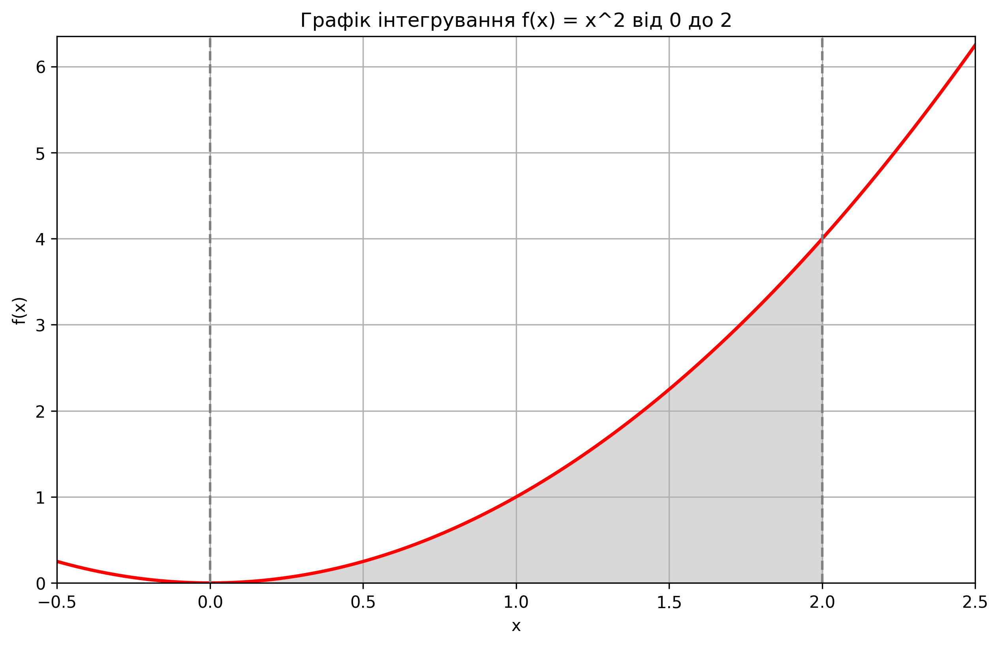
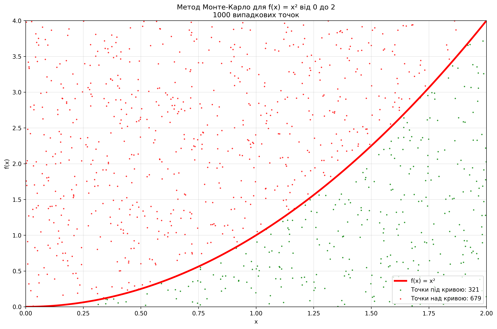

# Порівняння алгоритмів розміну монет

## Опис завдання

Реалізовано два алгоритми для задачі розміну монет:
1. **Жадібний алгоритм** (`find_coins_greedy`) - вибирає найбільші доступні номінали
2. **Динамічне програмування** (`find_min_coins`) - знаходить мінімальну кількість монет

Номінали монет: [50, 25, 10, 5, 2, 1]

## Результати тестування

### Тест для суми 113:
- **Жадібний алгоритм**: {50: 2, 10: 1, 2: 1, 1: 1} (5 монет)
- **Динамічне програмування**: {50: 2, 10: 1, 2: 1, 1: 1} (5 монет)

### Час виконання:

| Сума  | Жадібний (с)     | ДП (с)          | Різниця швидкості |
|-------|------------------|-----------------|-------------------|
| 113   | 0.00000038      | 0.00002468      | 65.76x           |
| 1000  | 0.00000020      | 0.00026692      | 1348.65x         |
| 5000  | 0.00000019      | 0.00138661      | 7362.67x         |
| 10000 | 0.00000018      | 0.00281658      | 15980.61x        |

## Аналіз складності

### Жадібний алгоритм
- **Часова складність**: O(n), де n - кількість номіналів монет
- **Просторова складність**: O(k), де k - кількість різних номіналів у результаті
- **Переваги**: Дуже швидкий, простий у реалізації
- **Недоліки**: Не завжди знаходить оптимальне рішення для всіх систем монет

### Динамічне програмування
- **Часова складність**: O(amount × n), де amount - сума, n - кількість номіналів
- **Просторова складність**: O(amount)
- **Переваги**: Завжди знаходить оптимальне рішення
- **Недоліки**: Значно повільніший для великих сум

## Висновки

1. **Для канонічної системи монет** (як [50, 25, 10, 5, 2, 1]) жадібний алгоритм завжди дає оптимальний результат і працює в тисячі разів швидше

2. **Різниця в продуктивності зростає з розміром суми**: від 65x для суми 113 до 15980x для суми 10000

3. **Жадібний алгоритм має лінійну складність** відносно кількості номіналів, тоді як ДП має квадратичну залежність від суми

4. **Для великих сум** (10000+) різниця в швидкості стає критичною - жадібний алгоритм виконується практично миттєво

---

# Завдання 2: Обчислення інтеграла методом Монте-Карло

## Опис завдання

Реалізація методу Монте-Карло для обчислення значення інтеграла функції **f(x) = x²** на інтервалі **[0, 2]** з порівнянням результатів з аналітичним розв'язанням та функцією SciPy quad.

## Теоретичні основи

### Метод Монте-Карло
Метод Монте-Карло — це статистичний алгоритм, який використовує випадковість та ймовірність для розв'язання різних проблем. Основна ідея методу: використовувати випадкові зразки для апроксимації результатів.

## Результати експериментів

### Порівняння методів

| Метод                    | Результат   | Помилка      |
|--------------------------|-------------|--------------|
| Аналітичне розв'язання   | 2.666667    | -            |
| SciPy (quad)            | 2.666667    | ±2.96e-14    |
| Монте-Карло (50 експ.)  | 2.671920    | 0.197%       |

### Залежність точності від кількості точок

| Кількість точок (N) | Результат МК | Помилка | Відносна помилка (%) |
|---------------------|-------------|---------|---------------------|
| 1,000               | 2.488000    | 0.178667| 6.70%              |
| 10,000              | 2.640000    | 0.026667| 1.00%              |
| 100,000             | 2.678640    | 0.011973| 0.45%              |
| 500,000             | 2.664672    | 0.001995| 0.07%              |

## Візуалізація

## Висновки

### Що показали експерименти?

Ми змогли обчислити інтеграл функції x² від 0 до 2, "кидаючи" випадкові точки та підраховуючи, скільки з них потрапило під криву. Правильна відповідь - 2.666667, а наш метод дав 2.671920 з помилкою всього 0.197%.

### Як кількість точок впливає на точність?

Закономірність:
- **1,000 точок** → помилка 6.70% (грубо, але швидко)
- **10,000 точок** → помилка 1.00% (вже непогано)
- **100,000 точок** → помилка 0.45% (досить точно)
- **500,000 точок** → помилка 0.07% (дуже точно!)
